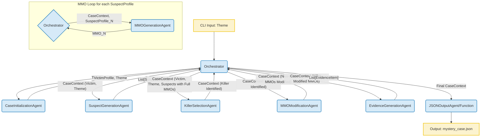
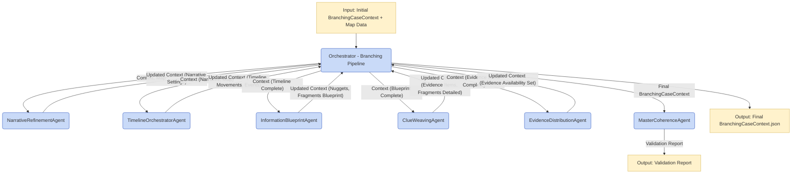

# Mystery.AI - System Architecture (MVP)

## 1. Introduction

This document outlines the technical architecture for the Minimum Viable Product (MVP) of Mystery.AI, an AI-driven agentic system for generating murder mystery game narratives. The architecture is designed to fulfill the requirements specified in the `prd.md` and the defined epics (`epic1.md` through `epic4.md`).

The core of the system is a Python application leveraging the OpenAI Agents SDK to orchestrate a sequence of specialized AI agents. Each agent performs a distinct step in the mystery generation process, transforming and enriching a central data object (`CaseContext`) until a complete mystery framework is produced as a JSON output.

## 2. Architectural Goals & Constraints (MVP)

- **Primary Goal:** Create a robust and understandable local command-line tool that reliably generates the foundational elements of a murder mystery.
- **Technology Constraint:** Exclusively use Python and the OpenAI Agents SDK for all AI agent functionality and LLM interactions.
- **Modularity:** Design agents with clear, distinct responsibilities to facilitate development, testing, and future iteration.
- **Data-Driven:** Utilize Pydantic models for strong data typing and structuring throughout the agent pipeline and for the final JSON output.
- **Simplicity (MVP):** Avoid unnecessary complexity. No external databases, APIs (beyond OpenAI via SDK), or dedicated servers for the MVP.
- **Traceability:** Ensure sufficient logging and leverage SDK tracing for debugging and understanding agent behavior.

## 3. High-Level Architecture Overview

The Mystery.AI MVP employs a **sequential, multi-agent pipeline architecture**. An orchestrator (either a main script or a dedicated `OrchestratorAgent`) manages the flow, invoking a series of specialized agents in a predefined order. Each agent takes the current state of the mystery (encapsulated in a `CaseContext` Pydantic model), performs its generation task using an LLM via the OpenAI Agents SDK, and returns the updated `CaseContext` to the orchestrator.

The primary components are:
1.  **Orchestrator (`run_mystery_generation.py` / `OrchestratorAgent`):** The main entry point and controller of the generation pipeline.
2.  **Specialized Generative Agents:** A series of agents, each responsible for a specific part of the mystery creation.
3.  **Data Model (`CaseContext`):** A central Pydantic model that accumulates all generated mystery data.

## 4. Component Breakdown & Agent Responsibilities

Clear Naming Conventions

The following agents are proposed for the MVP, each interacting via the `OrchestratorAgent`:

1.  **`CaseInitializationAgent`**:
    *   **Input:** Theme (string).
    *   **Responsibility:** Generates initial victim details (Name, Occupation, Personality, Cause of Death) based on the theme.
    *   **Output:** `VictimProfile` object, added to `CaseContext`.

2.  **`SuspectGenerationAgent`**:
    *   **Input:** `CaseContext` (containing theme and `VictimProfile`).
    *   **Responsibility:** Generates 2-3 unique suspect profiles (name, description, relationship to victim).
    *   **Output:** List of `SuspectProfile` objects.

3.  **`MMOGenerationAgent`**:
    *   **Input:** `CaseContext` (theme, victim) and a single `SuspectProfile`.
    *   **Responsibility:** For the given suspect, generates a plausible Means, Motive, and Opportunity (MMO), consistent with the case.
    *   **Output:** `MMO` object for that suspect.
    *   *(Note: The Orchestrator will call this agent for each suspect generated by `SuspectGenerationAgent`.)*

4.  **`KillerSelectionAgent`**:
    *   **Input:** `CaseContext` (with list of suspects, each having their full MMO).
    *   **Responsibility:** Randomly selects one suspect as the killer and updates their `is_killer` status in the `CaseContext`.
    *   **Output:** Updated `CaseContext` with killer identified.

5.  **`MMOModificationAgent`**:
    *   **Input:** `CaseContext` (with killer identified and suspects' original MMOs).
    *   **Responsibility:** For each non-killer suspect, selects one MMO element (Means, Motive, or Opportunity) and prompts an LLM to weaken/invalidate it, creating a red herring. Stores the modified element.
    *   **Output:** Updated `CaseContext` with modified MMOs for non-killers.

6.  **`EvidenceGenerationAgent`**:
    *   **Input:** `CaseContext` (with killer, suspects' original & modified MMOs).
    *   **Responsibility:**
        *   Generates 2-3 pieces of evidence supporting the killer's true MMO.
        *   Generates 1-2 red herring evidence items for each non-killer, pointing towards their original (now weakened) MMOs.
    *   **Output:** List of `EvidenceItem` objects, added to `CaseContext`.

7.  **`JSONOutputAgent` (or functionality within Orchestrator):**
    *   **Input:** Final `CaseContext` object.
    *   **Responsibility:** Serializes the `CaseContext` to a well-formatted JSON string and writes it to a file.
    *   **Output:** JSON file.

## 5. Agent Interaction Diagram (Simplified MVP Flow)

## 6. Data Flow (Revised)

The primary data structure is the `CaseContext` Pydantic model. It is initialized by the `OrchestratorAgent` (or at the start of the main script) and progressively enriched as it's passed through the agent pipeline. **All Pydantic models used for agent inputs or outputs requiring structured responses from the LLM must adhere to the constraints specified by OpenAI for structured outputs (e.g., no direct `dict` types, using nested models instead; refer to OpenAI documentation on supported JSON schema features for `response_format`).**

1.  **Initial:** Contains `theme` (string).
2.  **After `CaseInitializationAgent`:** Adds `VictimProfile` (Pydantic model).
3.  **After `SuspectGenerationAgent` & `MMOGenerationAgent` loop:** Adds `List[Suspect]` (where each `Suspect` is a Pydantic model containing `SuspectProfile` and original `MMO` - both Pydantic models).
4.  **After `KillerSelectionAgent`:** `is_killer` flag (boolean) is set for each `Suspect`.
5.  **After `MMOModificationAgent`:** Modified MMO elements are added to non-killer `Suspect` objects (likely as new fields within the `Suspect` model or a nested `ModifiedMMO` Pydantic model).
6.  **After `EvidenceGenerationAgent`:** Adds `List[EvidenceItem]` (where `EvidenceItem` is a Pydantic model).
7.  This final, fully populated `CaseContext` is then serialized to JSON.

## 7. OpenAI Agents SDK Usage (Revised)

-   **Import Convention:** The SDK is installed as `openai-agents` but imported in Python code as `agents` (e.g., `from agents import Agent, Runner`). **Care must be taken to avoid naming local Python modules `agents.py` to prevent import conflicts.**
-   **Agents:** Each component (e.g., `CaseInitializationAgent`) will be defined as an `agents.Agent` instance, with specific `instructions`, `name`, and the `model` parameter specifying the LLM (e.g., `model="gpt-4.1-mini"`). Additional model parameters like temperature are passed via `model_settings=ModelSettings(...)`.
-   **Structured Output (Pydantic Models):** Agents generating structured data (like `VictimProfile`, `MMO`, `List[EvidenceItem]`) will specify an `output_type` using a Pydantic model. **These Pydantic models must strictly adhere to the data types and structures supported by the OpenAI API for `response_format` with structured outputs.** This means using primitives (string, integer, boolean, number), `Enum`, arrays (lists) of supported types, or nested objects (which translate to nested Pydantic models). Direct usage of Python `dict` types or complex `Union` types within these Pydantic models for LLM output definition is generally not supported and must be avoided by using nested Pydantic models. Refer to [OpenAI Structured Outputs Guide](https://platform.openai.com/docs/guides/structured-outputs?api-mode=responses).
-   **Runner:** The `OrchestratorAgent` (or main script) will use `agents.Runner.run()` (or `run_sync()`) to execute each specialized agent, passing the current `CaseContext` (or relevant parts) as input. The `RunConfig` object can be used with the `Runner` to customize tracing for specific runs.
-   **Handoffs (Implicit):** For this MVP, the orchestration is primarily sequential and code-driven. The `OrchestratorAgent` explicitly calls the next agent.
-   **Tracing:** The SDK's built-in tracing will be active by default. Enhanced tracing with specific workflow names, IDs, and metadata will be implemented as detailed in Section 9.

## 8. Error Handling and Resilience (MVP Focus)

For the MVP, error handling will focus on ensuring the local command-line tool can gracefully handle common issues and provide informative feedback to the developer/user.

-   **Agent-Level Errors:**
    -   Each specialized agent, when executed by the `Runner`, should include `try-except` blocks to catch potential exceptions during LLM calls (e.g., API errors, timeouts, malformed responses if not perfectly matching Pydantic `output_type`).
    -   If an LLM call fails or returns unusable data after a reasonable number of retries (TBD, could be 0-1 for MVP), the agent should log the error extensively and either:
        -   Return a specific error indicator or a partially filled data object to the orchestrator.
        -   For MVP, it might be acceptable to halt the entire process with a clear error message if a critical generation step fails.
-   **Data Validation:** Pydantic models will provide automatic validation for the `output_type` of agent responses. If an LLM returns JSON that doesn't conform to the specified Pydantic model, the Agents SDK/Pydantic will raise an error. This should be caught and logged.
-   **Orchestrator Resilience:** The main orchestrator script should handle errors returned by individual agents. For the MVP, if a critical agent fails, the orchestrator will log the failure and terminate, providing a clear message. It will not attempt complex recovery or alternative paths.
-   **Input Validation:** Basic validation of the initial CLI theme input (e.g., ensuring it's provided) will be handled by `argparse`.

## 9. Logging and Debugging (Revised)

Effective logging and tracing are crucial for understanding the behavior of the multi-agent system and for debugging.

-   **Python `logging` Module:** The standard Python `logging` module will be used for application-level logging.
    -   Configuration: Set up in the main orchestrator script (console output, log level via CLI flag).
    -   Agent Logging: Each agent logs initiation, key steps, data summaries (non-sensitive), completion, and errors.
-   **OpenAI Agents SDK Tracing:**
    -   **Utilization:** The SDK's built-in tracing capabilities will be a primary debugging tool.
    -   **Viewing Traces:** Developers will view traces via the OpenAI Dashboard (if API key configured for tracing) or other configured processors.
    -   **Enriching Traces:** For significant operations like a full mystery generation, the main orchestrator will use the `with agents.trace(...)` context manager.
        -   `workflow_name`: A descriptive name (e.g., `"MysteryGeneration_MVP"`).
        -   `trace_id`: A unique ID for the entire run (e.g., UUID generated at start).
        -   `group_id`: (Optional) Could be used if multiple related traces form part of a larger user session in future iterations.
        -   `metadata`: Key input parameters (like the theme) and relevant configuration settings will be added as metadata to the trace for better context and filterability.
    -   **Sensitive Data:** Tracing of sensitive data in LLM inputs/outputs or function calls can be controlled via `RunConfig.trace_include_sensitive_data` if necessary. Refer to [OpenAI Agents SDK Tracing Documentation](https://openai.github.io/openai-agents-python/tracing/).
-   **Structured Output:** The final JSON output itself serves as a key debugging artifact, allowing inspection of the full generated mystery.

## 10. Configuration Management

For the MVP, configuration will be kept simple:

-   **OpenAI API Key:** Managed via an environment variable (`OPENAI_API_KEY`) loaded using `python-dotenv` from a `.env` file.
-   **CLI Arguments:**
    -   The primary input (e.g., `--theme`) will be passed via CLI arguments using `argparse` in the main script (`run_mystery_generation.py`).
    -   A `--debug` flag could control log verbosity.
-   **Agent-Specific Parameters (Initial Approach):**
    -   Parameters like the specific LLM model to use for an agent (e.g., `gpt-4.1-mini` for one, `o4-mini` for another), number of suspects to generate (2-3), or number of evidence items, will initially be hardcoded as constants within the agent definitions or the orchestrator script for simplicity in the MVP.
    -   **Future Consideration:** These could be moved to a simple configuration file (e.g., `config.json` or `config.py`) if more flexibility is needed during development or for experimentation beyond the immediate MVP scope.

## 11. Security Considerations (MVP Focus)

Given the local execution nature and MVP scope, security concerns are minimal but good practices will be followed:

-   **API Key Security:** The `OPENAI_API_KEY` is the primary secret. It will be stored in a `.env` file, which will be added to `.gitignore` to prevent accidental commits. A `.env.example` file will be provided.
-   **Input Sanitization:** The CLI theme input is a simple string. No complex parsing or direct OS command execution based on this input is planned.
-   **Output Data:** The generated JSON data contains fictional mystery elements. No real PII or sensitive production data is handled.
-   **Dependencies:** Keep Python package dependencies to a minimum and use well-known libraries to reduce supply chain risks. Regular updates are not a focus for the MVP's short lifecycle but would be for a longer-lived project.

## 12. Future Architectural Considerations (Post-MVP)

While the MVP focuses on a streamlined local generation process, future enhancements outlined in the PRD would necessitate architectural evolution:

-   **Database Integration:** For persistent storage of generated mysteries, user accounts, or more complex knowledge bases, a database (e.g., PostgreSQL, MongoDB) would be required.
-   **Web Interface/API:**
    -   To support user-facing interactions (prompt input, game play) or a tool for the primary author, a web framework (e.g., FastAPI, Django, Flask for an API; Streamlit, Gradio, or React for a UI) would be needed.
    -   This implies considerations for authentication, authorization, session management, and web security.
-   **Advanced Agent Orchestration:**
    -   Moving beyond a purely sequential pipeline to more dynamic, LLM-driven handoffs or parallel agent execution using the advanced features of the Agents SDK.
    -   Implementing more sophisticated "meta-agents" or "evaluator agents" for coherence checking (Red Team Agent, Ripple Effect Analyzer, etc.) would require more complex interaction patterns.
-   **Task Queues & Asynchronous Processing:** For longer generation tasks or a web-based service, using task queues (e.g., Celery with Redis/RabbitMQ) might become necessary to handle requests asynchronously.
-   **Scalability & Cloud Deployment:** If the tool gains traction or is offered as a service, deploying to a cloud platform (AWS, GCP, Azure) with considerations for auto-scaling, load balancing, and managed services would be essential.
-   **Enhanced Configuration Management:** A more robust configuration system (e.g., using dedicated config libraries, environment-specific configs) would be needed.
-   **CI/CD Pipeline:** For automated testing, building, and deployment.

## 13. Phase 2: Branching Evidence System Architecture (MVP)

This section details the architecture for the Branching Evidence System MVP. This system builds upon a foundational mystery (which might be generated by the pipeline described in Sections 1-12, or provided as a simplified `BranchingCaseContext` input) to create a more complex, interconnected web of evidence suitable for an elimination-focused mystery game.

The MVP for the Branching Evidence System focuses on a 3-suspect scenario, uses pre-loaded map data, implements simplified evidence corroboration logic, and makes all evidence items available to the player upfront.

### 13.1. Architectural Goals & Constraints (Branching Evidence MVP)

-   **Primary Goal:** Implement a foundational pipeline of agents that generates a solvable mystery with a structured timeline and interconnected evidence suitable for process-of-elimination gameplay.
-   **Technology Constraint:** Continues to use Python, Pydantic, and the OpenAI Agents SDK, consistent with the foundational system.
-   **Modularity:** Each new agent has a distinct responsibility in constructing the branching evidence layer.
-   **Data-Driven:** The `BranchingCaseContext` Pydantic model is central, progressively built by the new agent pipeline. (See `docs/data-models.md` - Branching Evidence section).
-   **MVP Simplifications:** Pre-loaded map data, all evidence initially available, simplified corroboration logic (focus on `SUPPORTED` status for nuggets), 3-suspect scenarios.

### 13.2. High-Level Architecture Overview (Branching Evidence MVP)

Similar to the foundational system, the Branching Evidence System MVP employs a **sequential, multi-agent pipeline architecture**. A dedicated orchestrator script (e.g., `run_full_branching_pipeline.py`) manages the flow, invoking a series of specialized agents. Each agent takes the current `BranchingCaseContext`, performs its task, and returns the updated context.

The primary components are:
1.  **Orchestrator (`run_full_branching_pipeline.py`):** Controls the branching evidence generation pipeline.
2.  **Specialized Branching Agents:** A new series of agents for this phase.
3.  **Data Model (`BranchingCaseContext`):** The central Pydantic model for this phase.

### 13.3. Component Breakdown & Agent Responsibilities (Branching Evidence MVP)

Refer to `docs/branching-evidence-design.md` (Section 3) for full details. The MVP versions of these agents are:

1.  **`NarrativeRefinementAgent` (MVP):**
    *   **Input:** Initial `BranchingCaseContext` (theme, victim, 3 suspects with basic MMOs, designated killer), `List[Location]` (from pre-loaded map data).
    *   **Responsibility (MVP):** Defines `core_murder_action_description`, `core_murder_action_stage_window`, and populates `timeline.settings` (`temporal_ambiguity_source`, `num_stages`, `stage_duration_description`, `critical_action_window_stages`). Minimal MMO refinement.
    *   **Output:** Updated `BranchingCaseContext`.

2.  **`(Map Data Loader - Pre-MVP Step)`**
    *   **Responsibility:** Map data (e.g., from `maps/Villa.json`) is loaded into `BranchingCaseContext.timeline.locations` before the `NarrativeRefinementAgent` or by the initial part of the orchestration script. (The `MapGeneratorAgent` from the design doc is out of scope for active generation in MVP).

3.  **`TimelineOrchestratorAgent` (MVP):**
    *   **Input:** `BranchingCaseContext` (with narrative refinements, map locations).
    *   **Responsibility (MVP):** Plots killer's path, establishes verifiable alibis for 2 non-killers across `critical_action_window_stages`, details all 3 suspects' locations (`CharacterLocationStage`) for each `TimeStage`. Generates a few critical `TimelineEvent` objects to support alibis/killer actions.
    *   **Output:** Updated `BranchingCaseContext` (`timeline.events`, `timeline.character_movements`).

4.  **`InformationBlueprintAgent` (MVP):**
    *   **Input:** `BranchingCaseContext` (with timeline, character movements).
    *   **Responsibility (MVP):** Identifies essential `InformationNugget` objects for alibis and killer path support. Defines 1-2 `InformationFragment` objects (with `atomic_fact_derived`) to establish each nugget. Populates `established_by_fragment_sets`. Sets `is_elimination_critical` flags and `status=UNKNOWN`. `CorroborationCondition` structures are defined but not actively used for status changes beyond `SUPPORTED` for MVP.
    *   **Output:** Updated `BranchingCaseContext` (`information_nuggets`, partially defined `information_fragments`).

5.  **`ClueWeavingAgent` (MVP):**
    *   **Input:** `BranchingCaseContext` (with information blueprint).
    *   **Responsibility (MVP):** Creates `BranchingEvidenceItem` objects. Generates `raw_data_from_evidence` for fragments (focus on `DIRECT_QUOTE` or simple `IMPLIED_BY_CONTEXT`). Composes `full_description` for items. Links fragments to source evidence and populates `BranchingEvidenceItem.contains_nugget_ids`.
    *   **Output:** Updated `BranchingCaseContext` (`evidence_items`, fully defined `information_fragments`).

6.  **`EvidenceDistributionAgent` (MVP):**
    *   **Input:** `BranchingCaseContext` (with all evidence items).
    *   **Responsibility (MVP):** Sets `is_initially_available = True` for all `BranchingEvidenceItem` objects.
    *   **Output:** Updated `BranchingCaseContext`.

7.  **`MasterCoherenceAgent` (MVP):**
    *   **Input:** Complete `BranchingCaseContext` from `EvidenceDistributionAgent`.
    *   **Responsibility (MVP):** Performs simplified validation: assumes fragments for a nugget are found making it `SUPPORTED`. Checks if non-killer alibis are `SUPPORTED`. Checks killer does not have a `SUPPORTED` alibi. Checks for wasted fragments. Basic solvability check: can killer be ID'd by elimination based on these `SUPPORTED` alibi nuggets?
    *   **Output:** Validation report (e.g., `{"is_coherent": True/False, "reason": "..."}`). Does not modify `BranchingCaseContext`.

### 13.4. Agent Interaction Diagram (Branching Evidence MVP Flow)

### 13.5. Data Flow (`BranchingCaseContext`)

The `BranchingCaseContext` Pydantic model is the central data structure, progressively enriched:
1.  **Initial:** Contains `theme`, `victim` (Optional[VictimProfile]), `suspects` (List[Suspect] - with basic MMOs, killer designated), and `timeline.locations` (from pre-loaded map).
2.  **After `NarrativeRefinementAgent`:** `timeline.settings` populated; `core_murder_action_description` and `core_murder_action_stage_window` added.
3.  **After `TimelineOrchestratorAgent`:** `timeline.events` and `timeline.character_movements` populated.
4.  **After `InformationBlueprintAgent`:** `information_nuggets` and `information_fragments` (partially) populated.
5.  **After `ClueWeavingAgent`:** `evidence_items` populated; `information_fragments` completed.
6.  **After `EvidenceDistributionAgent`:** `BranchingEvidenceItem.is_initially_available` fields set.

This final, fully populated `BranchingCaseContext` is then serialized to JSON.

### 13.6. OpenAI Agents SDK Usage, Error Handling, Logging, Configuration (Branching Evidence MVP)

These aspects will follow the same principles and conventions established for the foundational MVP (Sections 7, 8, 9, 10 of this document), applied to the new agents and orchestration script for the Branching Evidence System.
-   **SDK Usage:** New agents are `agents.Agent` instances, using `output_type` with Pydantic models from `data_models_branching.py`.
-   **Error Handling:** Focused on graceful CLI feedback for agent failures.
-   **Logging:** Python `logging` and SDK tracing for the new pipeline.
-   **Configuration:** `OPENAI_API_KEY` via `.env`. Other parameters (e.g., number of timeline stages for MVP if not LLM-determined) likely as constants in the orchestration script or agent definitions.

### 13.7. Security Considerations (Branching Evidence MVP)

Remain consistent with Section 11. The new system introduces more complex data generation but does not fundamentally change the security posture for the local CLI tool MVP.

### 13.8. Future Architectural Considerations (for Branching Evidence)

Beyond the MVP, future enhancements for the Branching Evidence System (as detailed in `docs/branching-evidence-design.md` and `docs/prd-branching-evidence.md` Post-MVP section) would include:
-   **Advanced Map Generation:** Fully implementing `MapGeneratorAgent`.
-   **Complex Corroboration:** Implementing full logic for `CorroborationCondition` and `NuggetStatus` transitions.
-   **Dynamic Evidence Distribution:** Implementing sophisticated logic in `EvidenceDistributionAgent`.
-   **Iterative Coherence Checks:** Enabling the `MasterCoherenceAgent` to trigger re-runs of specific upstream agents based on detailed feedback.
-   **User Interaction Layer:** Potentially a game interface to play through the generated mystery, which would require significant new architectural components (UI, game state management, player input handling). 